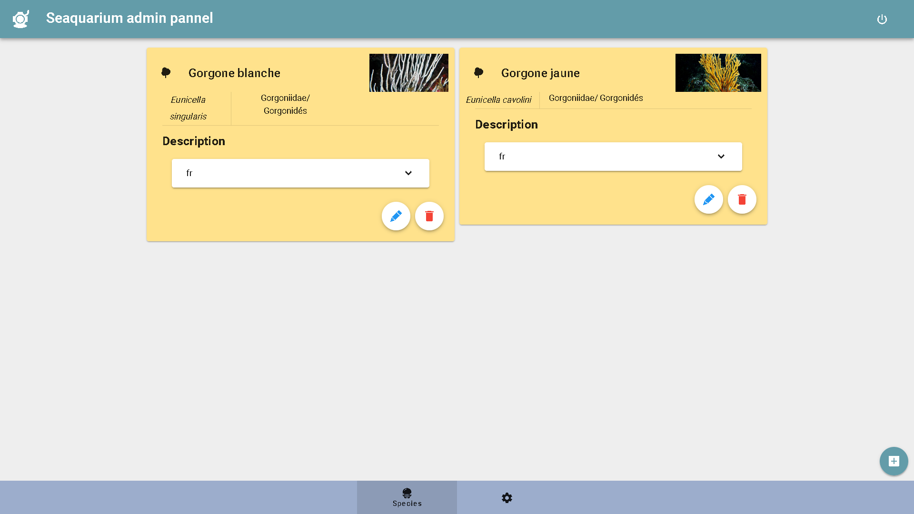
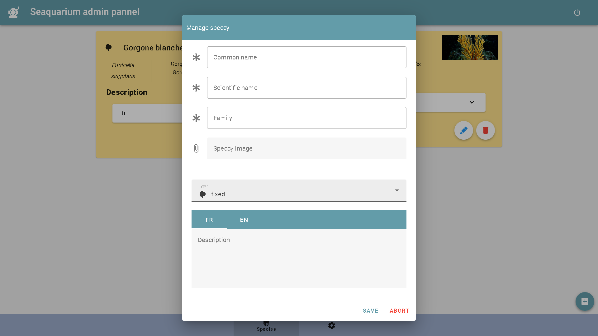
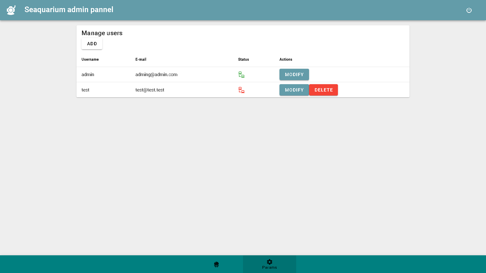
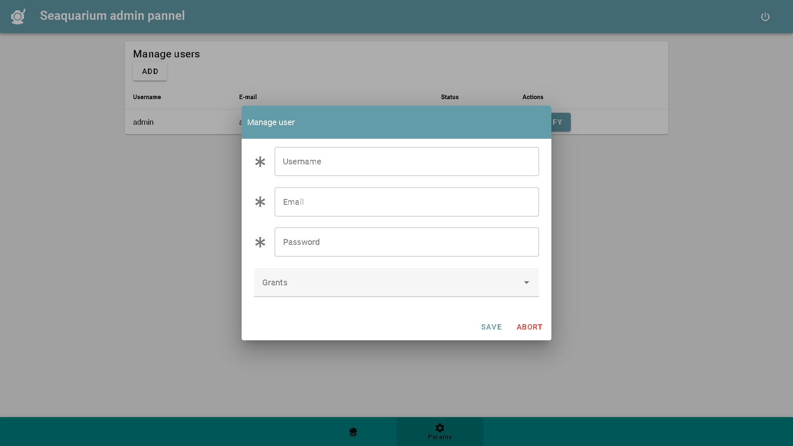
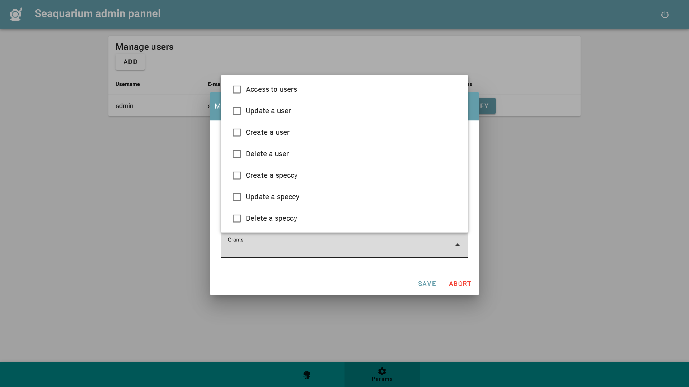

# back-fish

## Utilisation de l'interface

---

### **Interface des espèces**

Voici l'interface de visualisation des espèces présentes dans la base de données.

Il est possible d'[ajouter de nouvelles espèces](#ajout-et-édition-dune-espèce) avec le bouton **+** en bas à droite;  
D'[éditer une espèce existante](#ajout-et-édition-dune-espèce) avec le bouton **crayon** sur chaque espèce;  
D'en supprimer avec le bouton **poubelle** sur chaque espèce.



#### **Ajout et édition d'une espèce.**

Ce formulaire s'ouvre quand vous voulez ajouter ou éditer une espèce.

Les champs précédés d'une **asterisque** sont obligatoire.  
Les champs optionnels sont utiles pour ajouter une image et une description à l'espèce. (cela peut être fait plus tard si vous ne disposez pas de ces informations dans l'immédiat)



---

### **Interface des utilisateurs**

Voici l'interface de gestion des utilisateurs de l'aplication de gestion de la base de donnée.

Il est ici possible d'[ajouter des nouveaux utilisateurs](#ajout-et-édition-dun-utilisateur) avec le bouton **ADD**;  
De gérer leurs droits et d'[éditer leurs informations](#ajout-et-édition-dun-utilisateur) avec le bouton **MODIFY**;  
Et de les supprimer avec le bouton **DELETE**.

Sur cet onglet l'état de connexion de chaque utilisateur s'affiche en temps réel.



#### **Ajout et édition d'un utilisateur**

Ce formulaire s'ouvre quand vous voulez ajouter un utilisateur.

Les champs précédés d'une **asterisque** sont obligatoire.
Le dernier champ est la [liste des droits d'utilisateurs attribués](#droits-de-lutilisateur).



#### **Droits de l'utilisateur**

*Access to users* : Droit de visualiser la liste des utilisateurs.  
*Create a user* : Droit de créer de nouveaux utilisateurs.  
*Update a user* : Droit de modifier les informations des utilisateurs.  
*Delete a user* : Droit de supprimer des utilisateurs.  
*Create a speccy* : Droit d'ajouter de nouvelles espèces à la base de données.  
*Update a speccy* : Droit de modifier les informations des espèces de la base de données.  
*Delete a speccy* : Droit de retirer des espèces de la base de données.



---

## Docker

```docker
docker volume create database-fish

docker build -t back-fish .
docker run -it --rm --volume database-fish:/api/instance --publish 80:80 --name server-fish back-fish
```