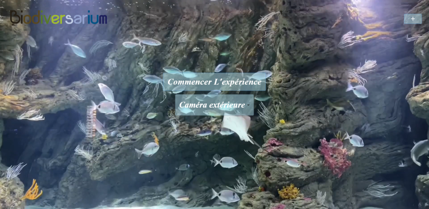

# Interface Borne Responsive

## Page d'accueil

## Utilisation

_Pour utiliser la borne, il faut d’abord sélectionner la caméra que vous voudriez visionner (intérieur pour la caméra à l’intérieur du bassin ou extérieur pour la caméra externe au bassin )._

_Ensuite cliquez sur commencer l'expérience. _

_Vous allez être redirigé vers une autre page où se fera la reconnaissance des espèces dans l’aquarium.
Si vous voulez avoir plus d’informations sur  une espèce précise, il suffit de cliquer sur celle-ci, ensuite la description sera affichée en bas de la caméra._

