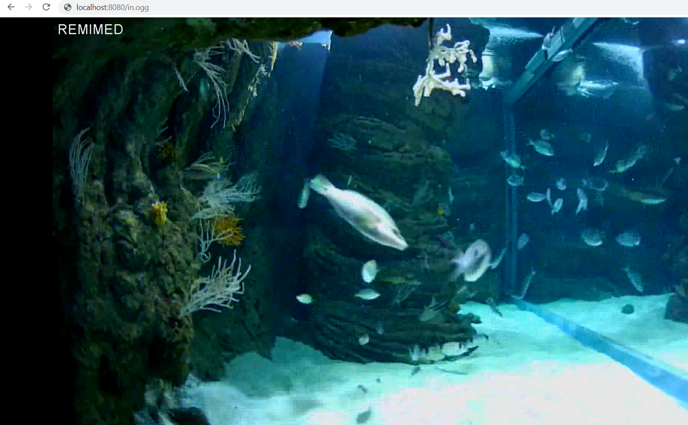

# Proxy video
**Auteur :** [BEN HASSEN Douraïd](https://www.linkedin.com/in/doura%C3%AFd-ben-hassen/), Ingénieur IA


## Description
Serveur local qui permet de transformer un **flux video RTSP** et de le diffuser en **flux video HTTP** avec **les autorisations CORS** nécessaires.

## Utilisation
Commandes VLC :
```
vlc URL_RTSP :sout=#transcode{vcodec=theo,vb=800,scale=1,width=1920,height=1080,acodec=none,scodec=none}:http{dst=:8080/in.ogg} :no-sout-all :sout-keep
```
```
vlc URL_RSTP :sout=#transcode{vcodec=theo,vb=800,scale=1,width=1920,height=1080,acodec=none,scodec=none}:http{dst=:8081/out.ogg} :no-sout-all :sout-keep
```
